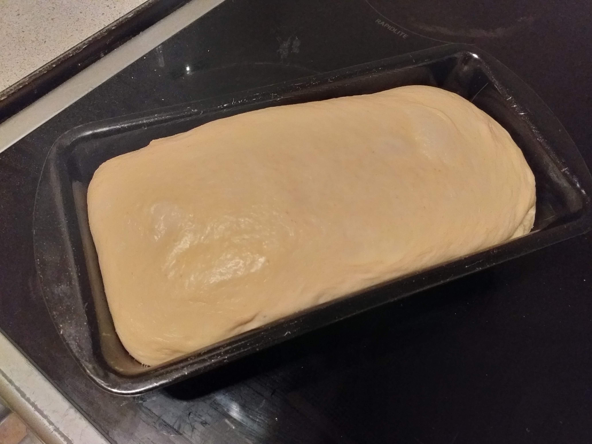
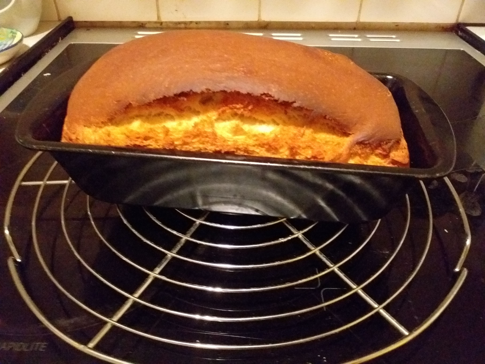

This is a very simple and quick bread made using this recipe: https://www.kingarthurflour.com/recipes/classic-sandwich-bread-recipe from King Arthur Flour.
Made exactly according to the recipe.

Here is the dough just before going in the oven:

This is the bread after coming out of the oven:

