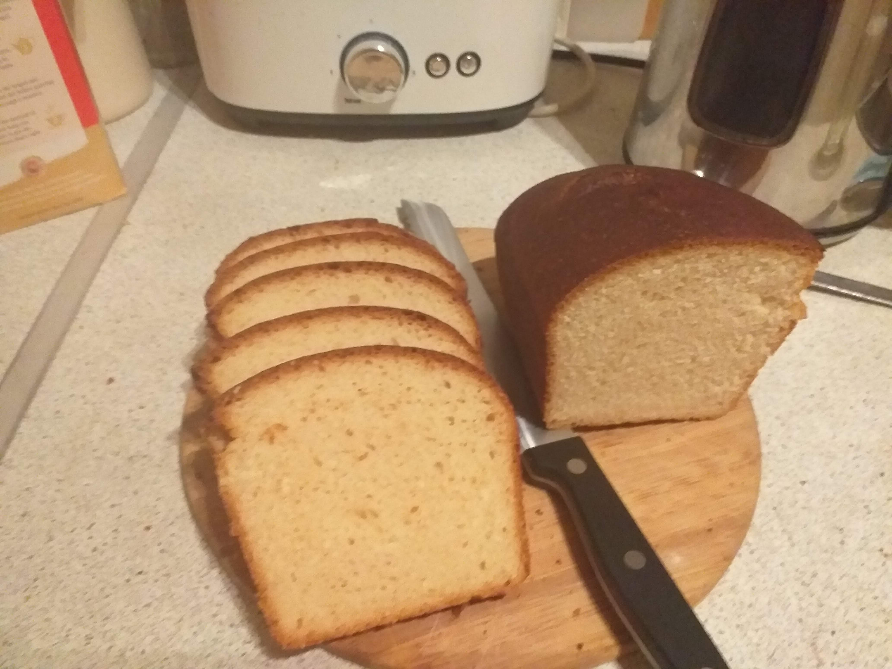

This is a very simple and quick bread made using this recipe: https://www.kingarthurflour.com/recipes/classic-sandwich-bread-recipe from King Arthur Flour.
Made according to the recipe except with (the same amount of) brown sugar instead of white. I think this caused the bread to be sweeter than the recipe and possibly not
as much of a rise. It also could probably have done with some more kneading. But it turned out quite well.

Here is the dough just before going in the oven:

This is the bread after coming out of the oven:

This is the bed cooled and sliced:

