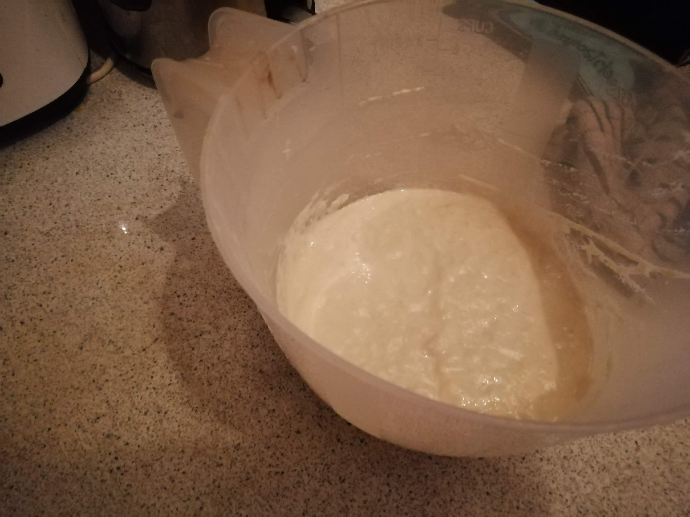
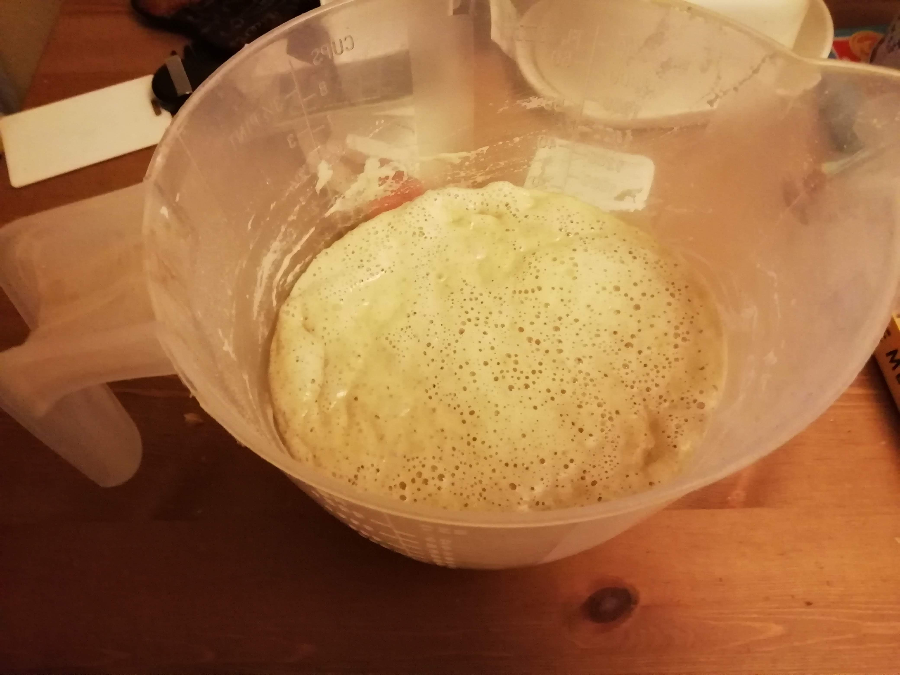
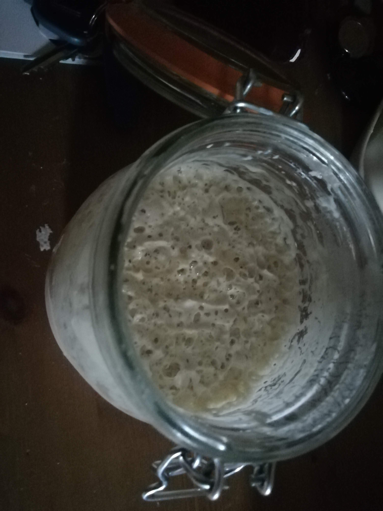

* 300g flour
* 300ml tepid water
* Bowl or large measuring jug
* Clean tea towel
* Sealable glass jar such as a Kilner jar (not too tall to fit in your fridge!)

You can use any type of flour for the starter. All purpose or plain flour will work fine, and is probably easiest for your first time making a starter. You can always modify the mother culture later with different types of flour.
Some recipes will also use fruit such as apples or grapes along with flour and water to speed up the initial activity of the starter, but it is definitely possible to make a good starter with simple plain flour and water (and time!).

Method

1. Add 300g flour and 300ml tepid water into a bowl or large measuring jug. It's a good idea to weigh the bowl or jug before adding anything, and keep a note of the value for the future, so that you always know how much starter you have. Stir well (e.g. with a fork) until all of the flour has been evenly mixed, and a smooth batter is formed. Cover loosely with a clean tea towel, and leave in a fairly warm place (i.e. around room temperature, not close to the oven).
2. Stir the mixture every now and again (around once per day). After a couple of days, there should be some bubbles forming in the starter, and a slightly sour smell.
3. When there are significant bubbles forming in the starter, pour away half of the mixture by weight and replace with another 150g flour and 150ml water and stir again.
4. Repeat step 3 every day for about a week. The starter should become more active as time goes on, so that it bubbles up more quickly after feeding. It should also have a strong yeasty smell. If you originally used a measuring jug, you should transfer the mixture to a sealable glass jar (such as a Kilner jar). You should use a just that will fit on a shelf in your fridge, as yyou will want to store the starter in the fridge now and again to slow down the feeding process (unless you plan to make sourdough bread every day).
5. The starter should now be ready to use to make sourdough bread. As with the standard feeding process, remove up to half of the starter to add to your dough mixture and feed the starter as usual. You can store the starter in the fridge for up to about a week without feeding, but you should feed it a day before using it to bake bread. Check out any of the sourdough recipes for ideas on baking bread using sourdough.

Images

Initial flour and water batter mixture

Starter after 2 days (lots of bubbles forming)

Starter after 10 days (ready to use to make sourdough bread)

