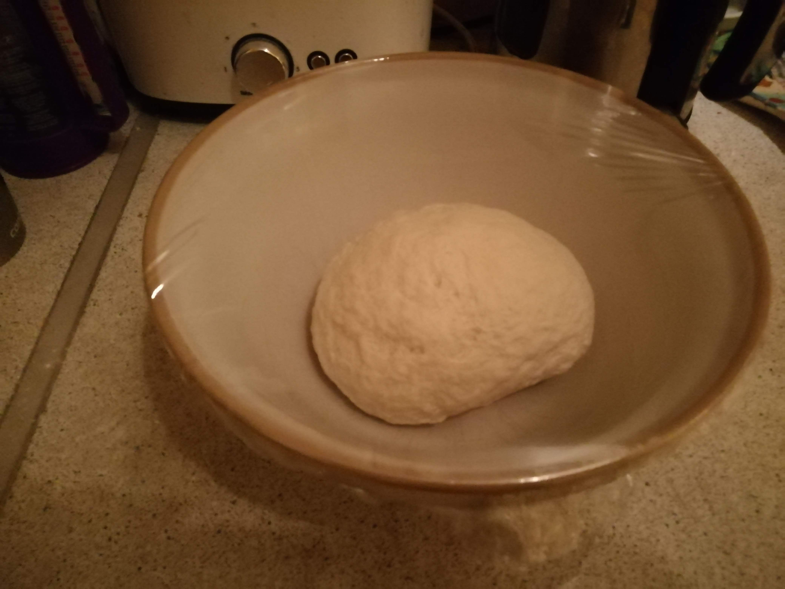
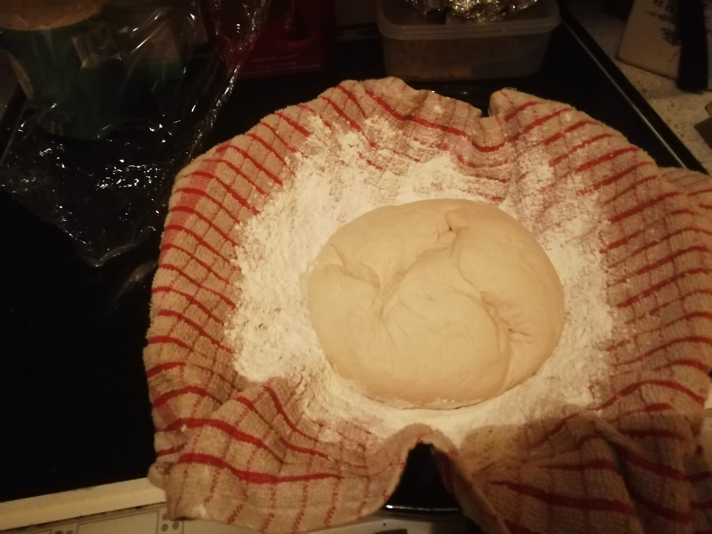
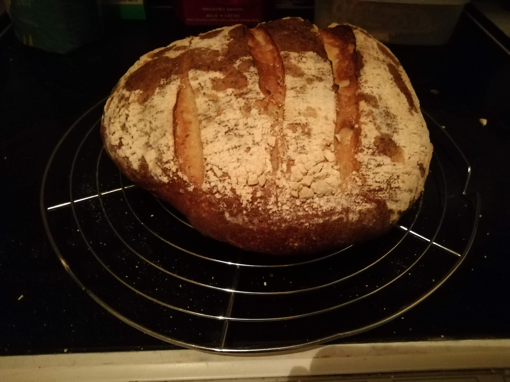

* 400g strong white flour
* 240g sourdough 
* 1 tbsp honey
* salt
* 240-300ml water (as needed)

Method:
 
1. Mix the flour, sourdough, salt, honey and water in a bowl. Knead until springy, and cover with cling film.
2. Allow to rise for about 3 hours.
3. Knock back the dough and shape into a ball. Place a heavily floured tea towel into a shallow bowl, and turn the dough ball upside down onto the towel. Cover loosely with cling film. Allow to prove for about 6-8 hours. You can also leave to prove overnight by storing in a fridge.
4. Heat an oven to 230-250 degrees Celsius. Place a roasting tin in the bottom of the oven and pour some cold water into the tin to allow some steam to develop.
5. Turn the dough ball onto a floured baking tray and make some score marks with a sharp knife or blade on the top of the dough, before placing the dough in the oven.
6. Bake for 25-35 minutes.

Rising dough

Proving

Finished

